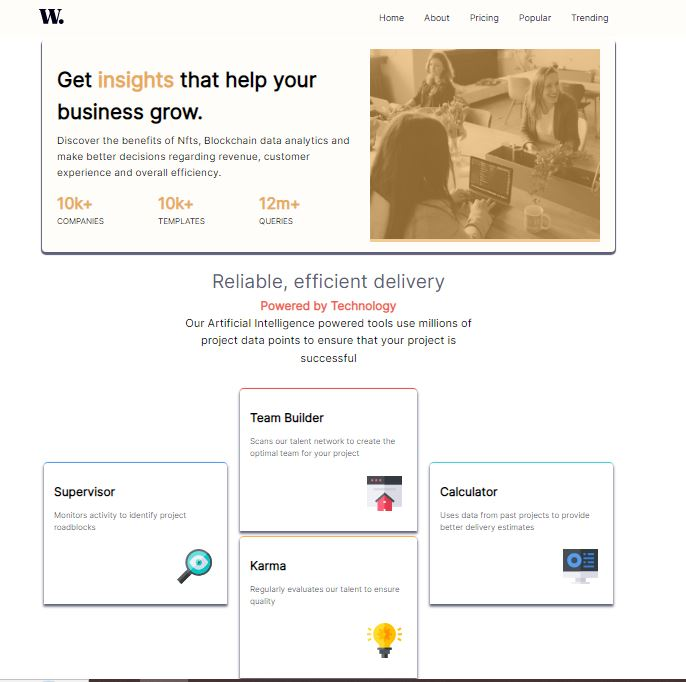
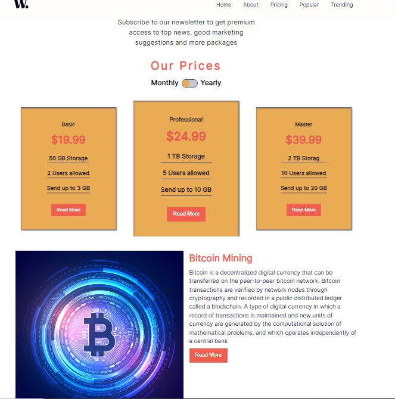
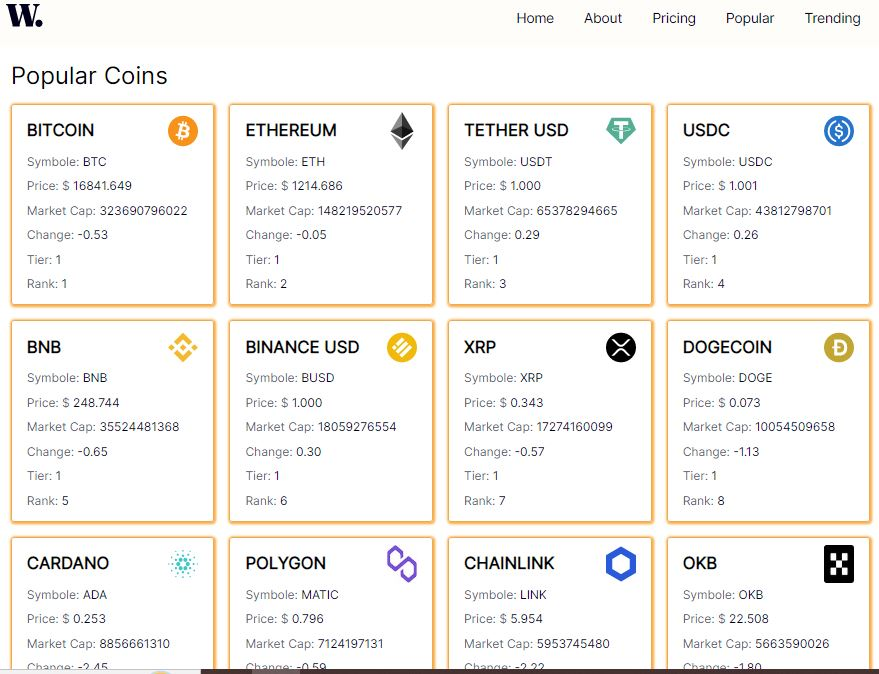
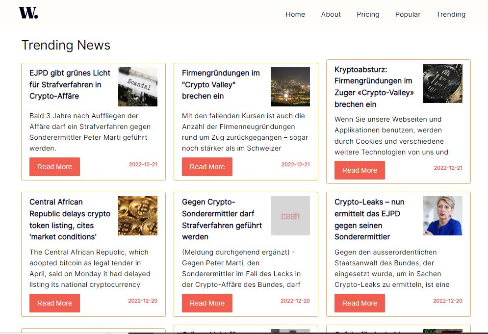

# WEB 3.0 BLOG CHAIN

## This project is a combination of some frontend mentor challenges with some addition of api end points to make a little big sophisticated and interesting

Its a 5 page website with two (Popular and Trending) bein dyanmic and others being static. This Project is intended to get hands dirty on using react and next js in buiding application for the web. The Popular and the Trending page are not part of the frontend mentor challenge. Though some of the frontend challenges were modefied and added upon

To make it interesting, it has the ability to get some coins and news from a trusted apin end point which is Bing Search News API.

## HOME PAGE

## About Page

## Price Page

## Popular Page

## Trending Page

